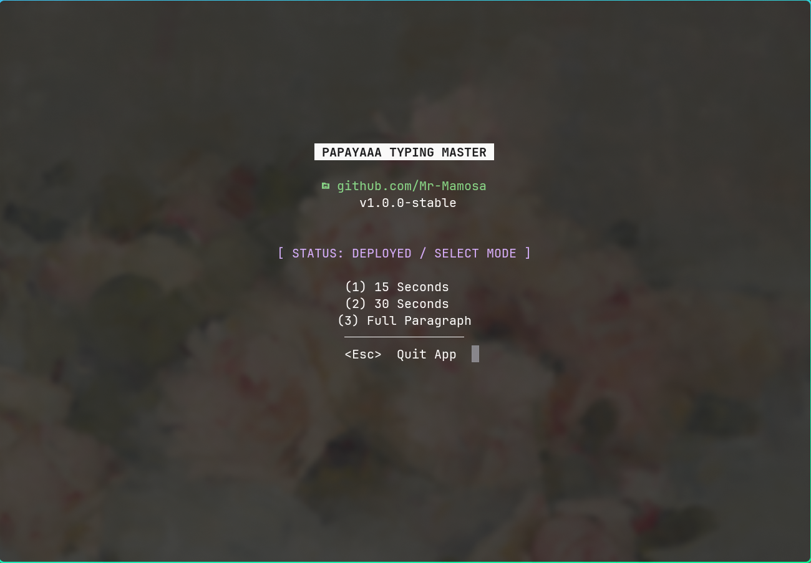

# 󰓃 PaPaYaaa Typing Master

A high-performance, aesthetic CLI typing application built with **Python** and the **Curses** library. This project focuses on Terminal User Interface (TUI) design and real-time data tracking.

# 󰓃 PaPaYaaa Typing Master




## 🚀 Features
* **Catppuccin Mocha Theme**: A professional, easy-on-the-eyes color palette inspired by modern Vim setups.
* **Multiple Game Modes**: Choose between 15s, 30s sprints, or "Marathon" full-paragraph mode.
* **Infinite Text Logic**: Paragraphs recycle automatically so your race never stops until the timer hits zero.
* **High Score Tracking**: Persistent personal bests are retrieved from local storage to track improvement.

## 🛠️ Technical Stack
* **Language**: Python 3.x
* **Library**: `curses` (Standard Library)
* **Environment**: Arch Linux / Vim

## 📊 Future Milestones (Data Science)
As part of my **BSc Computer Science** studies, I plan to use the generated CSV data to:
1. Plot **WPM Growth Curves** using Matplotlib.
2. Implement **Linear Regression** to predict typing speed improvement over 30 days.
3. Identify "weak features" (specific keys with high latency).

## 📥 Installation
1. Clone the repo:
   ```bash
   git clone [https://github.com/Mr-Mamosa/typing-master-cli.git](https://github.com/Mr-Mamosa/typing-master-cli.git)
